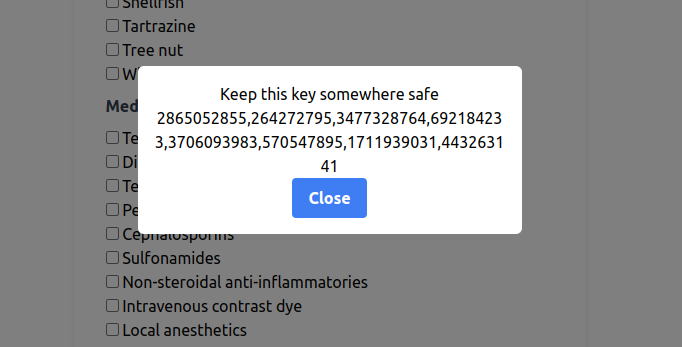

# Chainmed

## Change log 7/31/23

### Smart Contracts
#### Manager
- Updated functions `addDoctor`, `addPatient`
#### DoctorFactory and PatientFactory
- Updated functions `createDoctor`, `createPatient`
- No more creating new instances of Doctor and Patient from an Application contract
#### Doctor
- Updated function `initialize`
#### Patient
- Removed fields of information
- Removed setter for fields of information
- Updated function `initialize`
- Added fields `info`, `updates`
    - `info` is to replace previously seperated fields of information
    - `updates` is a queue of updated patient information
- Added function `getUpdates` to view `updates`, require read access
- Added function `addUpdate` to add to `updates`, require write access
- Added functions `approveUpdate`, `removeUpdate`, `updateInfo`, only callable by patient
    - `approveUpdate` sets `info` to one element in `updates`
    - `removeUpdate` remove one element from `updates`
    - `updateInfo` allows patient to update `info` directly
### Applications
#### Manager
- A key is generated when user register, user should keep this for recovery.

- QRcode now also includes patient's key
- User can make changes and see new updates to their info
- Having patient approve new updates is to prevent bad actors encrypting petient info with other key

#### Chaindoser
##### Backend
- `/api/report` endpoint now checks session token instead of SIWE message signature
##### Patient UI
- Patient info now need to be decrypted with their key
- QRcode now also includes patient's key
- Patient needs to enter their key after login, since this is a seperate application
    - The key will be saved in localstorage

- Patient don't need to sign the message anymore when reporting taking their medicines
##### Doctor UI
- The QRcode scan in `/prescribe` now grabs the patient key for decryption and store it in localstorage
- Doctor can make changes to patient info in `/patient/[id]` and add to `updates` in the smart contract
